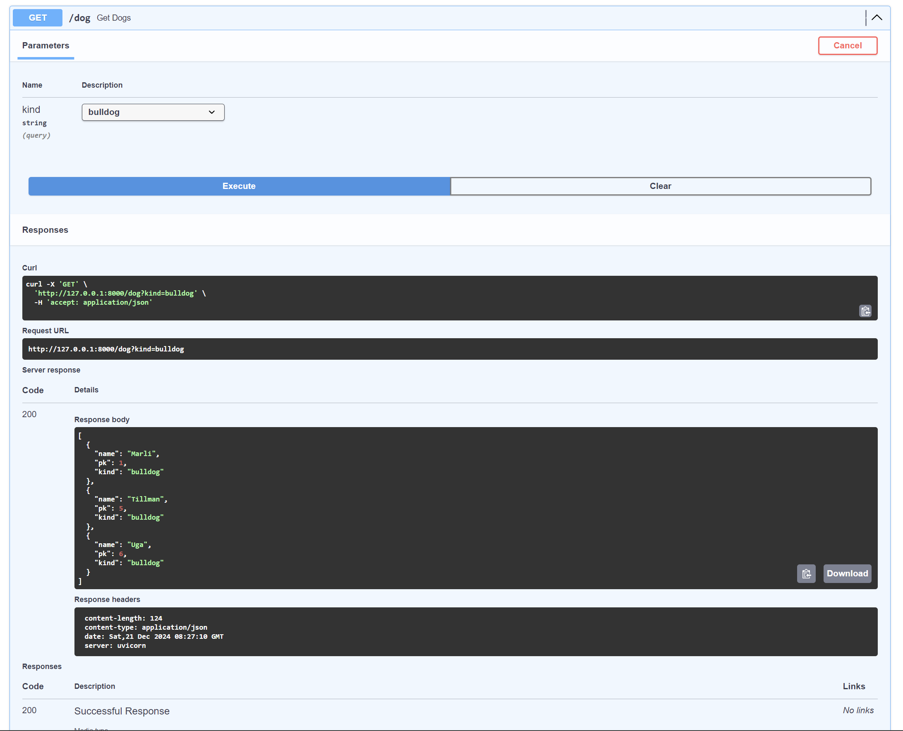
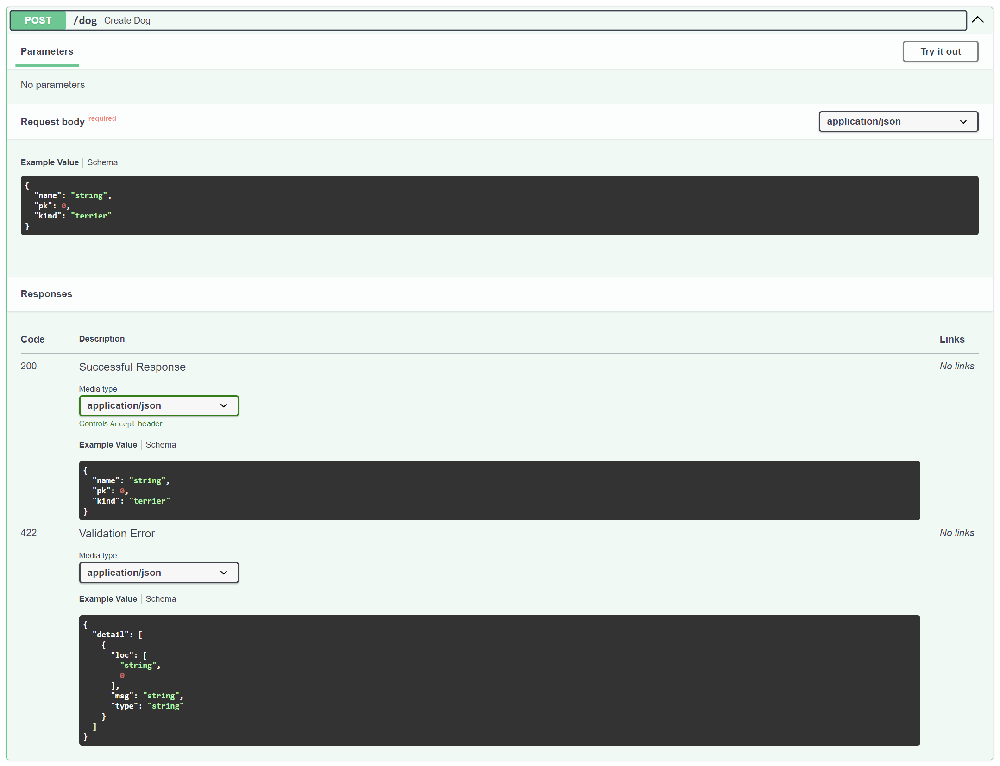
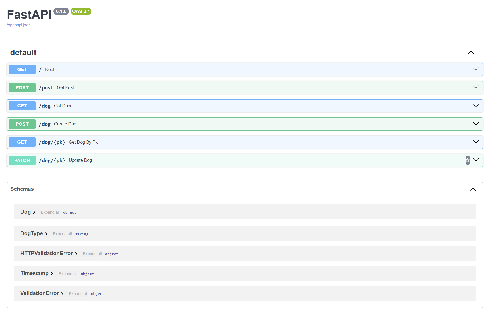

# Микросервис для хранения и обновления информации о собаках

## Описание

Микросервис реализует `REST API` для хранения данных о собаках и выполнения `CRUD-операций` (создание, чтение, обновление, удаление). Также предусмотрено фильтрование собак по типу (породе).

## Технологии

1. Python 3.9+
2. FastAPI
3. Pydantic
4. Uvicorn

## Установка и запуск

**Клонируйте репозиторий:**
```bash
git clone <URL>
cd <Папка>
```

**Создайте и активируйте виртуальное окружение:**

```bash
python -m venv venv
source venv/bin/activate # для Linux/Mac
venv\Scripts\activate    # для Windows
```

**Установите зависимости:**

```bash
pip install -r requirements.txt
```

**Запустите сервис:**

```bash
uvicorn main:app --reload
```

Откройте браузер и перейдите по адресу http://127.0.0.1:8000/docs для ознокомления с `Swagger UI`

### Примеры запросов

1. Получить список собак

`GET /dog`

**Пример ответа:**

```bash
[
  {
    "name": "Bob",
    "pk": 0,
    "kind": "terrier"
  },
  {
    "name": "Marli",
    "pk": 1,
    "kind": "bulldog"
  }
]
```

2. Создание новой собаки

`POST /dog`

**Пример запроса:**

```bash
{
  "name": "Charlie",
  "pk": 7,
  "kind": "terrier"
}
```

**Пример ответа:**

```bash
{
  "name": "Charlie",
  "pk": 7,
  "kind": "terrier"
}
```

3. Обновление данных собаки

`PATCH /dog/{pk}`

**Пример запроса:**

```bash
{
  "name": "Charlie",
  "pk": 7,
  "kind": "bulldog"
}
```

**Пример ответа:**

```bash
{
  "name": "Charlie",
  "pk": 7,
  "kind": "bulldog"
}
```

## Фотографии







## Авторы

Разработка и документация: команда ветеринарной клиники и отдел ит.
